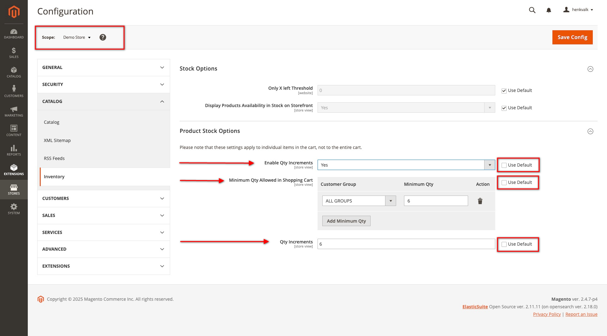

# FalconMedia_MoqIncrementsPerStore

By default, Magento 2 doesn't allow you to change the configuration for Product Stock Options on a specific Store.

## Features

Possibilities to configure on Store:
- Enable Qty Increments (yes/no)
- Set Minimum Qty Allowed in Shopping Cart for Customer Groups 
- Set Qty Increments

## Installation details

```
composer require falconmedia/magento2-moq-increments-per-store
php bin/magento module:enable FalconMedia_MoqIncrementsPerStore
php bin/magento setup:upgrade
php bin/magento setup:di:compile
php bin/magento setup:static-content:deploy -f -t Magento/backend -j2 
```

## Usage
1. Open `Stores > Configuration` in your Magento Admin Dashboard
2. Change the `scope` to change the configuration specific for a Store
3. Go to `Catalog > Inventory`
4. deselect the `Use default` so you can change the values. 

